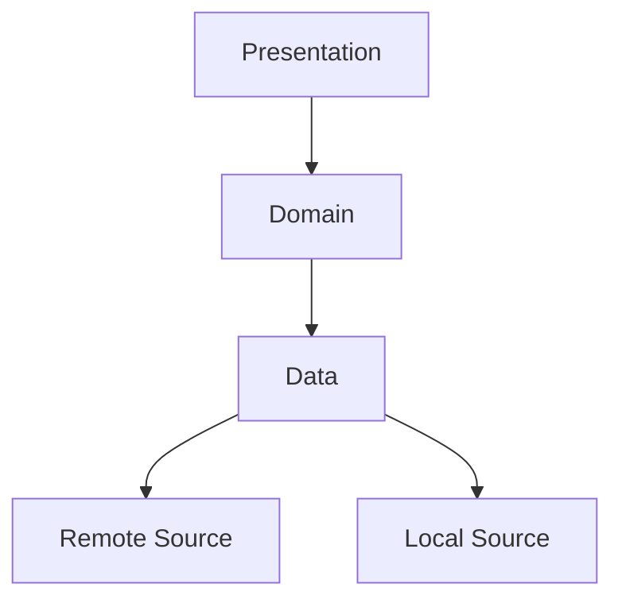
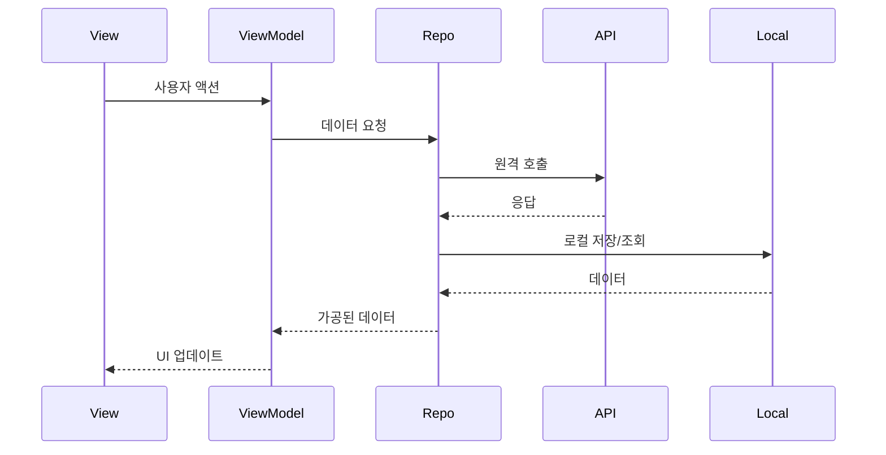

# 📚 Educational Platform Demo

Flutter로 구현한 **교육 플랫폼 데모** 앱으로, 강좌 탐색·상세 조회·수강 관리 기능을 시연합니다.

---

## 📱 프로젝트 개요

이 애플리케이션은 Flutter 기반 모바일 앱으로, 사용자는 다양한 강좌를 탐색하고 상세 정보를 확인하며 수강 신청/취소를 관리할 수 있습니다.

무한 스크롤, 마크다운/HTML 렌더링, 로컬 저장 등 주요 요구사항을 최대한 반영해 구현했습니다.

---

## ✨ 주요 기능

### 🏠 홈 화면


- **무료 강좌** 가로 스크롤 리스트
- **추천 강좌** 가로 스크롤 리스트
- **내 학습** (수강 신청한 과목)
- **무한 스크롤** – 10개 단위 페이징
- **강좌 카드** – 이미지·로고·제목·설명·태그 표시

### 📖 강좌 상세 화면


- **강좌 정보** – 제목·설명·이미지 등
- **Markdown/HTML 렌더링** – 풍부한 서식 지원
- **커리큘럼** – 강의(lectures) 리스트
- **수강 토글** – 신청 ↔ 취소
- **수강 상태 로컬 저장** – 앱 재시작 후에도 유지

### ⚙️ 공통

- **반응형 UI** (화면 크기·방향 대응)

---

## 🏗️ 아키텍처



- **Presentation**: View + ViewModel (MVVM)
- **Domain**: Repository 인터페이스
- **Data**: Repository 구현·데이터 소스 관리
- **패턴**: MVVM / Repository / DI(GetX)

데이터 흐름:



---

## 📁 프로젝트 구조

```
lib/
├─ app/              # 라우팅·전역 설정
├─ core/             # 상수·테마·유틸
├─ data/             # 모델·API·로컬 저장소·Repository 구현
├─ domain/           # Repository 인터페이스
├─ presentation/     # View, ViewModel, 컴포넌트
├─ di/               # 의존성 주입(바인딩)

```

주요 컴포넌트

| 파일/클래스 | 역할 |
| --- | --- |
| **AppPages** | 모든 라우트·바인딩 정의 |
| **HomeViewModel** | 홈 화면 상태 관리 |
| **CourseDetailViewModel** | 상세 화면 상태 관리 |
| **Repository 구현체** | 원격+로컬 데이터 조합 |

---

## 🛠️ 사용 기술

| 영역 | 라이브러리 |
| --- | --- |
| **Core** | Flutter · Dart |
| **상태/라우팅** | GetX |
| **네트워킹** | Dio |
| **모델** | Freezed · JsonSerializable |
| **스토리지** | Shared Preferences |
| **UI** | Infinite Scroll Pagination · Flutter Markdown · Flutter HTML · Flutter SVG |
| **테스트** | Flutter Test · Mockito · Widgetbook |

---

## 🚀 설치 & 실행

### 사전 준비

- Flutter SDK 3.2.3+
- Dart SDK 3.2.3+
- Android Studio 또는 VS Code (Flutter Extension)
- Android/iOS 시뮬레이터 또는 실기기

### 설치 절차

```bash
# 1. 클론
git clone https://github.com/iljinjung/edu_platform_demo.git
cd edu_platform_demo

# 2. 패키지 설치
flutter pub get

# 3. 코드 생성(Freezed)
flutter pub run build_runner build --delete-conflicting-outputs

# 4. 앱 실행
flutter run

```

---

## 📖 사용 방법


1. **앱 실행** → 홈 화면에 **무료·추천·내 학습** 섹션 노출
2. 가로 스크롤로 강좌 탐색 → 카드 터치 → 상세 화면
3. 상세에서 **수강하기** / **수강 취소** 버튼으로 상태 변경
4. 뒤로 가기 → 홈의 **내 학습** 섹션이 자동 갱신

---

## 🧪 테스트

```bash
# 단위·위젯 테스트
flutter test

# 위젯북(UI 카탈로그)
cd widgetbook
flutter run

```


## 🧩 Design Review & CI 연동

PR 단위로 UI 컴포넌트 리뷰가 가능한 구조를 설정했습니다.  
**디자인 리뷰 플로우**와 **GitHub Actions 기반 테스트 자동화**로 협업 상황에서도 안정적으로 유지보수할 수 있습니다.

### 🎯 Design Review Flow


- **PR 생성 시**: UI 변경사항이 자동으로 [Widgetbook Cloud](https://cdn.widgetbook.io/17fefd8b-1774-4ab3-b951-0f88aabeb5e0/7d3e6ab2-689e-4c1b-bb95-03aab70b52c5/builds/9dd601d8-6530-4038-88d0-ff5cf0a90143/index.html)로 업로드됨
    
- 디자이너나 리뷰어는 별도 빌드 없이 웹에서 변경사항을 직접 확인 가능
    

### 🛠 GitHub Actions 테스트 구성


- `flutter_test.yml` : PR 생성 시 테스트 자동 실행
    
- `widgetbook-cloud-hosting.yml` : 위젯북 자동 빌드 & 클라우드 업로드
    

> `.github/workflows/`에 설정된 CI 스크립트를 통해 모든 PR이 검증된 뒤 병합됩니다.
