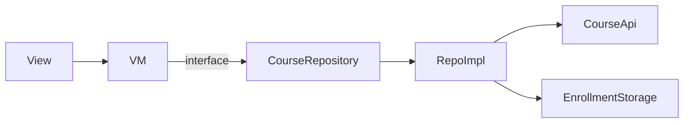

## 🎨 디자인 요구사항

1. **Academy 홈(간소화)** 2 개 화면 구현
2. **Figma** 스펙 100 % 적용 — 해상도별 반응형 필수
3. 디자인에 없는 사항은 **Figma > 개발자 자율** 우선순위로 결정

---

## 🛠️ 개발 요구사항

| JSON Key | 의미 | 화면 사용 |
| --- | --- | --- |
| `courses` | **Course** 리스트 | Home 카테고리 |
| `course` | 단일 **Course** | 상세 정보 |
| `lectures` | **Lecture** 리스트 | 커리큘럼 |


---

## 🏠 View 1 – Home (추천·무료·내 학습)

1. **데이터 로드** : Course List API
2. **헤더** : 엘리스 로고 + 검색(모형)
3. **리스트 컨테이너**
    - 세로 스크롤 (전체)
    - 각 카테고리 카드 → 가로 스크롤
    - **Infinity Scroll** 10개 단위 호출
4. **내 학습** : 수강 신청 과목 저장 (앱 재시작 유지)
5. **과목 카드**
    - 200×100 상단
    - 제목 2줄, 설명 2줄, 태그 2줄
    - 클릭 → 상세 화면 이동

---

## 📚 View 2 – Course Detail

1. **진입** : Home 카드 터치
2. **데이터** : Course Get API + Lecture List API
3. **App Bar** : Back 버튼
4. **Action Button** (고정)
    - 수강 신청/취소 토글
    - 로컬 저장 → 재실행 유지
5. **스크롤 영역**
    - **Title & Image** : `image_file_url` 유무에 따른 Large/Small
    - **Image Area** : 2 : 1, 가로 Fill
    - **Description** : Markdown 표시, 없으면 숨김
    - **Lectures** : title + description 표시

---

## 🔌 API 명세 (요약)

| API | 메서드 | 필수 쿼리 | 용도 |
| --- | --- | --- | --- |
| [Course List](https://www.notion.so/1dc5d93d970f80109706d603327e6534?pvs=21) | GET `/course/list/` | `offset` `count` | 추천·무료·검색 |
| [Course Get](https://www.notion.so/1dc5d93d970f80109706d603327e6534?pvs=21) | GET `/course/get/` | `course_id` | 상세 정보 |
| [Lecture List](https://www.notion.so/1dc5d93d970f80109706d603327e6534?pvs=21) | GET `/lecture/list/` | `course_id` | 커리큘럼 |

---

## 🗂️ 폴더 구조 (2‑계층 패턴 : 도메인 레이어의 비즈니스로직 생략)

```
lib/
├─ app/              # 라우팅·전역 설정
├─ core/             # 상수·테마·유틸
├─ data/
│   ├─ model/        # Course, Lecture
│   ├─ remote/       # dio client, api
│   ├─ local/        # enrollment_storage
│   └─ repository/   # course_repository_impl.dart
├─ domain/
│   └─ repository/   # course_repository.dart (interface)
├─ presentation/
│   ├─ view/         # home/, detail/
│   ├─ view_model/
│   ├─ components/   # course_card.dart 등
│   └─ widgetbook/   # widgetbook.dart
└─ di/               # bindings.dart

```

---

## ⚡ 핵심 의존성

| 기능 | 패키지 |
| --- | --- |
| HTTP 통신 | `dio` |
| DI·상태·라우팅 | `get` |
| 로컬 저장 | `shared_preferences` |
| 무한스크롤 | `infinite_scroll_pagination` |
| Markdown 뷰어 | `flutter_markdown` |
| UI 미리보기 & 시각 회귀 | `widgetbook` |
| 단위 테스트 | `flutter_test`, `mockito` |

---

## 🖥️ 아키텍처 다이어그램



---

## 🧪 테스트 전략

| 레벨 | 도구 | 목표 |
| --- | --- | --- |
| **WidgetBook** | `widgetbook` | 컴포넌트 상태 QA |
| **Unit** | `flutter_test` + `mockito` | ViewModel·Repository 로직 |
| **Integration** | `integration_test` | Home→Detail 플로우 + 상태 유지 |

---

## ⏳ 작업(Task) · 예상 소요

| 단계 | 내용 | 시간(hrs) |
| --- | --- | --- |
| 1 | 초기 세팅·의존성 | 1 |
| 2 | Model + API 클라이언트 | 3 |
| 3 | Repository 구현 | 2 |
| 4 | HomeViewModel + 무한스크롤 | 3 |
| 5 | CourseCard 컴포넌트 | 2 |
| 6 | HomeView UI | 2 |
| 7 | DetailViewModel + 수강 토글 | 2 |
| 8 | CourseDetailView UI | 3 |
| 9 | WidgetBook 스토리 | 1 |
| 10 | Unit·Golden 테스트 | 3 |
| **총합** | 약 22h |  |

---
